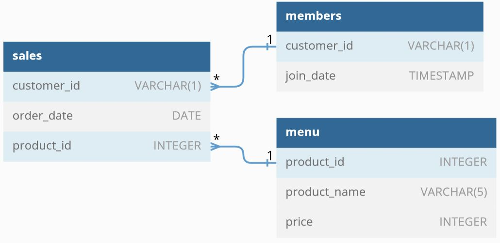

### Danny's Diner

Quickstart: Install the database onto your local mysql installation. ( For more installation options, please refer to https://8weeksqlchallenge.com/case-study-1/ )

`mysql -u <username> -p < /path/to/dannys_diner-schema-and-data-mysql.sql`

or
```
mysql -u <username> -p

source /path/to/dannys_diner-schema-and-data-mysql.sql
```
The results of the import are:

```
Query OK, 0 rows affected (0.05 sec)

Query OK, 1 row affected (0.06 sec)

Query OK, 0 rows affected (0.44 sec)

Query OK, 15 rows affected (0.50 sec)
Records: 15  Duplicates: 0  Warnings: 0

Query OK, 0 rows affected (0.59 sec)

Query OK, 3 rows affected (0.14 sec)
Records: 3  Duplicates: 0  Warnings: 0

Query OK, 0 rows affected (0.17 sec)

Query OK, 2 rows affected (0.10 sec)
Records: 2  Duplicates: 0  Warnings: 0
```

The Entity Relation Diagram of the 'dannys_diner' database ( https://dbdiagram.io/embed/608d07e4b29a09603d12edbd ):

</img>

The structure of the database:

```
mysql> select database();
+--------------+
| database()   |
+--------------+
| dannys_diner |
+--------------+
1 row in set (0.00 sec)

mysql> show tables;
+------------------------+
| Tables_in_dannys_diner |
+------------------------+
| members                |
| menu                   |
| sales                  |
+------------------------+
3 rows in set (0.00 sec)

mysql> describe members;
+-------------+------------+------+-----+---------+-------+
| Field       | Type       | Null | Key | Default | Extra |
+-------------+------------+------+-----+---------+-------+
| customer_id | varchar(1) | YES  |     | NULL    |       |
| join_date   | date       | YES  |     | NULL    |       |
+-------------+------------+------+-----+---------+-------+
2 rows in set (0.00 sec)

mysql> describe menu;
+--------------+------------+------+-----+---------+-------+
| Field        | Type       | Null | Key | Default | Extra |
+--------------+------------+------+-----+---------+-------+
| product_id   | int        | YES  |     | NULL    |       |
| product_name | varchar(5) | YES  |     | NULL    |       |
| price        | int        | YES  |     | NULL    |       |
+--------------+------------+------+-----+---------+-------+
3 rows in set (0.00 sec)

mysql> describe sales;
+-------------+------------+------+-----+---------+-------+
| Field       | Type       | Null | Key | Default | Extra |
+-------------+------------+------+-----+---------+-------+
| customer_id | varchar(1) | YES  |     | NULL    |       |
| order_date  | date       | YES  |     | NULL    |       |
| product_id  | int        | YES  |     | NULL    |       |
+-------------+------------+------+-----+---------+-------+
3 rows in set (0.00 sec)

```


/* --------------------
   Case Study Questions
   --------------------*/

-- 1. What is the total amount each customer spent at the restaurant?
-- 2. How many days has each customer visited the restaurant?
-- 3. What was the first item from the menu purchased by each customer?
-- 4. What is the most purchased item on the menu and how many times was it purchased by all customers?
-- 5. Which item was the most popular for each customer?
-- 6. Which item was purchased first by the customer after they became a member?
-- 7. Which item was purchased just before the customer became a member?
-- 8. What is the total items and amount spent for each member before they became a member?
-- 9.  If each $1 spent equates to 10 points and sushi has a 2x points multiplier - how many points would each customer have?
-- 10. In the first week after a customer joins the program (including their join date) they earn 2x points on all items, not just sushi - how many points do customer A and B have at the end of January?

-- Example Query:
SELECT
  	product_id,
    product_name,
    price
FROM dannys_diner.menu
ORDER BY price DESC
LIMIT 5;