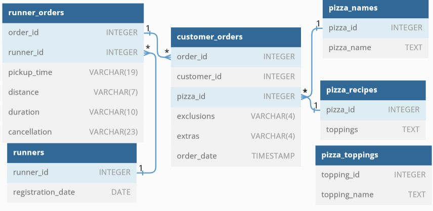

### Pizza Runner

Quickstart: Install the database onto your local mysql installation. ( For more installation options, please refer to https://8weeksqlchallenge.com/case-study-2/ )

`mysql -u <username> -p < /path/to/pizza_runner-schema-and-data-mysql.sql`

or
```
mysql -u <username> -p

source /path/to/pizza_runner-schema-and-data-mysql.sql
```
The results of the import are:

```
Query OK, 0 rows affected, 1 warning (0.11 sec)

Query OK, 1 row affected (0.02 sec)

Database changed
ERROR 1064 (42000): You have an error in your SQL syntax; check the manual that corresponds to your MySQL server version for the right syntax to use near '--SET search_path = pizza_runner' at line 1
Query OK, 0 rows affected, 1 warning (0.03 sec)

Query OK, 0 rows affected (0.57 sec)

Query OK, 4 rows affected (0.23 sec)
Records: 4  Duplicates: 0  Warnings: 0

Query OK, 0 rows affected, 1 warning (0.04 sec)

Query OK, 0 rows affected (0.54 sec)

Query OK, 14 rows affected (0.12 sec)
Records: 14  Duplicates: 0  Warnings: 0

Query OK, 0 rows affected, 1 warning (0.01 sec)

Query OK, 0 rows affected (0.26 sec)

Query OK, 10 rows affected (0.18 sec)
Records: 10  Duplicates: 0  Warnings: 0

Query OK, 0 rows affected, 1 warning (0.01 sec)

Query OK, 0 rows affected (0.23 sec)

Query OK, 2 rows affected (0.09 sec)
Records: 2  Duplicates: 0  Warnings: 0

Query OK, 0 rows affected, 1 warning (0.09 sec)

Query OK, 0 rows affected (0.31 sec)

Query OK, 2 rows affected (0.13 sec)
Records: 2  Duplicates: 0  Warnings: 0

Query OK, 0 rows affected, 1 warning (0.05 sec)

Query OK, 0 rows affected (0.18 sec)

Query OK, 12 rows affected (0.17 sec)
Records: 12  Duplicates: 0  Warnings: 0
```
The Entity Relation Diagram of the 'pizza_runner' database ( https://dbdiagram.io/embed/5f3e085ccf48a141ff558487 ):

</img>

The structure of the database:

```sql
mysql> select database();                                      
+--------------+                                               
| database()   |                                               
+--------------+                                               
| pizza_runner |                                               
+--------------+                                               
1 row in set (0.00 sec)                                        
                                                               
mysql> show tables;                                            
+------------------------+                                     
| Tables_in_pizza_runner |                                     
+------------------------+                                     
| customer_orders        |                                     
| pizza_names            |                                     
| pizza_recipes          |                                     
| pizza_toppings         |                                     
| runner_orders          |                                     
| runners                |                                     
+------------------------+                                     
6 rows in set (0.01 sec)                                       
                                                               
mysql> describe customer_orders;                               
+-------------+------------+------+-----+---------+-------+    
| Field       | Type       | Null | Key | Default | Extra |    
+-------------+------------+------+-----+---------+-------+    
| order_id    | int        | YES  |     | NULL    |       |    
| customer_id | int        | YES  |     | NULL    |       |    
| pizza_id    | int        | YES  |     | NULL    |       |    
| exclusions  | varchar(4) | YES  |     | NULL    |       |    
| extras      | varchar(4) | YES  |     | NULL    |       |    
| order_time  | timestamp  | YES  |     | NULL    |       |    
+-------------+------------+------+-----+---------+-------+    
6 rows in set (0.00 sec)                                       
                                                               
mysql> describe pizza_names;                                   
+------------+------+------+-----+---------+-------+           
| Field      | Type | Null | Key | Default | Extra |           
+------------+------+------+-----+---------+-------+           
| pizza_id   | int  | YES  |     | NULL    |       |           
| pizza_name | text | YES  |     | NULL    |       |           
+------------+------+------+-----+---------+-------+           
2 rows in set (0.01 sec)                                       
                                                               
mysql> describe pizza_recipes;                                 
+----------+------+------+-----+---------+-------+             
| Field    | Type | Null | Key | Default | Extra |             
+----------+------+------+-----+---------+-------+             
| pizza_id | int  | YES  |     | NULL    |       |             
| toppings | text | YES  |     | NULL    |       |             
+----------+------+------+-----+---------+-------+             
2 rows in set (0.00 sec)                                       
                                                               
mysql> describe pizza_toppings;                                
+--------------+------+------+-----+---------+-------+         
| Field        | Type | Null | Key | Default | Extra |         
+--------------+------+------+-----+---------+-------+         
| topping_id   | int  | YES  |     | NULL    |       |         
| topping_name | text | YES  |     | NULL    |       |         
+--------------+------+------+-----+---------+-------+         
2 rows in set (0.01 sec)                                       
                                                               
mysql> describe runner_orders;                                 
+--------------+-------------+------+-----+---------+-------+  
| Field        | Type        | Null | Key | Default | Extra |  
+--------------+-------------+------+-----+---------+-------+  
| order_id     | int         | YES  |     | NULL    |       |  
| runner_id    | int         | YES  |     | NULL    |       |  
| pickup_time  | varchar(19) | YES  |     | NULL    |       |  
| distance     | varchar(7)  | YES  |     | NULL    |       |  
| duration     | varchar(10) | YES  |     | NULL    |       |  
| cancellation | varchar(23) | YES  |     | NULL    |       |  
+--------------+-------------+------+-----+---------+-------+  
6 rows in set (0.00 sec)                                       
                                                               
mysql> describe runners;                                       
+-------------------+------+------+-----+---------+-------+    
| Field             | Type | Null | Key | Default | Extra |    
+-------------------+------+------+-----+---------+-------+    
| runner_id         | int  | YES  |     | NULL    |       |    
| registration_date | date | YES  |     | NULL    |       |    
+-------------------+------+------+-----+---------+-------+    
2 rows in set (0.00 sec)                                       
                                                               
```

Schema SQL Query SQL Results
Edit on DB Fiddle

Schema SQL Query SQL ResultsEdit on DB Fiddle
-- Example Query:
SELECT
	runners.runner_id,
    runners.registration_date,
	COUNT(DISTINCT runner_orders.order_id) AS orders
FROM pizza_runner.runners
INNER JOIN pizza_runner.runner_orders
	ON runners.runner_id = runner_orders.runner_id
WHERE runner_orders.cancellation IS NOT NULL
GROUP BY
	runners.runner_id,
    runners.registration_date;                                                       